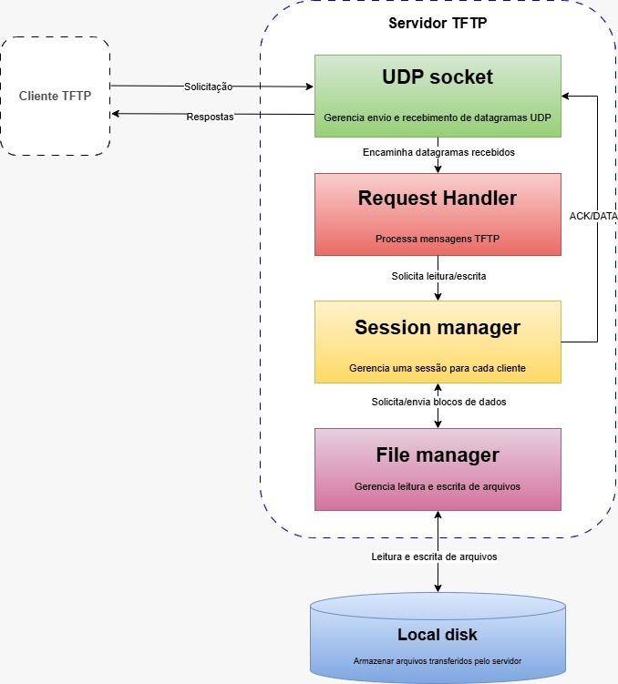
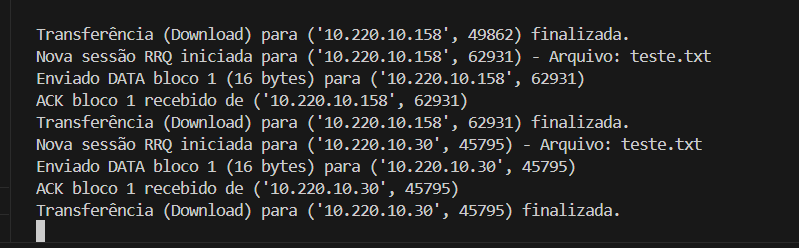
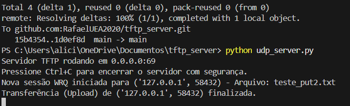

# tftp_server

Servidor dedicado à implementação do protocolo **TFTP (Trivial File Transfer Protocol)**, desenvolvido para a disciplina de **Tópicos Avançados em Computação I**.

## Integrantes
- Alicia Benedetto
- Daffiny Gomes
- Rafael Santos

## Descrição
Este projeto implementa um **servidor TFTP em Python**, utilizando comunicação via **UDP**, com suporte às operações principais de:

- **WRQ (Write Request / PUT)** → envio de arquivo do cliente para o servidor
- **RRQ (Read Request / GET)** → envio de arquivo do servidor para o cliente

O servidor foi desenvolvido para receber requisições de clientes TFTP e processar transferências de arquivos por blocos, conforme a lógica básica do protocolo TFTP.

## Diagrama de Componentes C4



## Como executar o servidor

Execute o servidor com:

```bash
python udp_server.py
```
## Como testar

Esta seção descreve os comandos básicos para validar o funcionamento do servidor nas operações de upload (PUT) e download (GET), utilizando um cliente TFTP local.

- Teste de upload (PUT)

Envia um arquivo do cliente para o servidor:
```bash
tftp -i 127.0.0.1 PUT seuarquivo.txt
```
- Teste de download (GET)

Baixa um arquivo do servidor para o cliente:
```bash
tftp -i 127.0.0.1 GET seuarquivo.txt
```

## Evidências dos testes

Esta seção reúne os resultados obtidos durante a validação prática do servidor, demonstrando que as operações de GET e PUT foram executadas com sucesso e que o sistema respondeu corretamente às requisições.

Os testes realizados tiveram como objetivo validar o funcionamento das duas operações principais do protocolo TFTP implementadas no servidor: **GET (download)** e **PUT (upload)**.

### Teste de GET
- **Objetivo:** verificar se o servidor consegue localizar um arquivo disponível localmente e enviá-lo corretamente ao cliente em blocos de dados, com confirmação via ACK.

- **Resultado observado:** o servidor iniciou a sessão RRQ, enviou o bloco de dados ao cliente, recebeu a confirmação correspondente e finalizou a transferência com sucesso.



### Teste de PUT

- **Objetivo:** verificar se o servidor consegue receber um arquivo enviado por um cliente, armazená-lo corretamente no disco local e confirmar o recebimento por meio de ACKs.

- **Resultado observado:** o servidor iniciou a sessão WRQ, recebeu o bloco de dados enviado pelo cliente, confirmou o recebimento e finalizou o upload com sucesso, salvando o arquivo no ambiente do servidor.




## Estrutura do projeto

- udp_server.py → inicialização do servidor UDP
- request_handler.py → tratamento das requisições e gerenciamento das sessões TFTP
- teste_cli.py → teste simples de requisição
- teste_get.py → teste local da operação GET
- teste_put.py → teste local da operação PUT